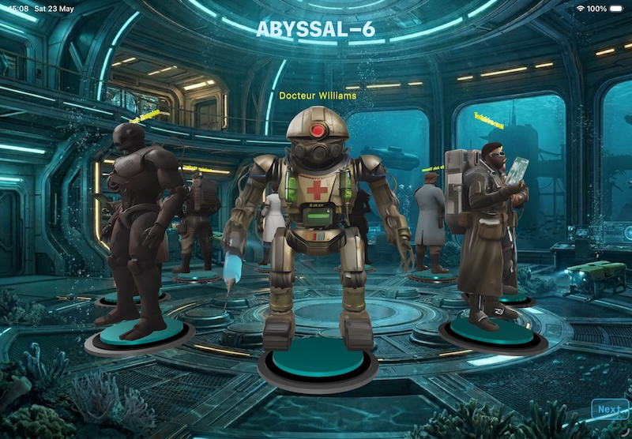

# Abyssal‑6 – iOS Port

**Abyssal‑6** is an immersive text‑based adventure game now available on **iOS**, built entirely with **SwiftUI**, **RealityKit**, and **Swift**.  
You are a survivor aboard a deep‑sea research station, 1,000 metres below the surface. Your mission: repair the fusion reactor before oxygen runs out and the pressure crushes you.


---

## 📱 The iOS Port

This repository contains a **complete port** of the original Java desktop game to **iOS**.  
All game logic, assets, and mechanics have been rewritten in **Swift** using **SwiftUI** for the user interface, **Combine** and **Observation** for state management, and native iOS frameworks for audio, animations, and **3D rendering** via **RealityKit**.

- **Original Java project**: [Abyssale-6 on GitHub](https://github.com/kazazyanalexander/Abyssale-6)
- **Official game website**: [https://kazazyanalexander.github.io/Abyssale-6/](https://kazazyanalexander.github.io/Abyssale-6/)

**Key differences from the Java version**:

- **Touch‑first UI** – tap to interact, context menus, gesture‑based navigation.
- **SwiftUI views** – `IntroView`, `MainGameView`, `ReactorPuzzleView`, `TransitionOverlayView`, and now **`FortniteStyleView`** for the character gallery.
- **`@Observable` view models** – `GameViewModel`, `TerminalViewModel`, `PuzzleViewModel`, `TransitionOverlayViewModel`, and `FortniteStyleModel`.
- **3D character gallery** – a rotating carousel of all game characters, each standing on a glowing pedestal, with floating name labels. Built with **RealityKit** and loaded from `.usdz` (or `.reality`) model files.
- **Native modal sheets & alerts** – inventory popup, give/talk dialogs, easter egg display.
- **Remote GIF backgrounds** – loaded from a URL (or local bundle) with `WKWebView` (custom `GIFImage`).
- **Touch‑triggered context menus** – single tap on characters/items opens a floating action menu near the tap location.
- **Automatic keyboard dismissal** – when a modal overlay appears, the keyboard is forced to close using `@FocusState` or `UIApplication`.
- **Full Game Center / iCloud save support** – optional (not shown in the provided code, but can be added).
- **Haptic feedback** – can be integrated (not in provided code, but trivial to add).

The gameplay, story, puzzles, and all assets (images, sounds, localisations) are identical to the original Java version.

---

## 🖼️ Screenshots

<div align="center">
   <br/>
  
  
</div>

*(Place the `sas.gif` and `win.gif` files inside the `docs/images/` folder of your repository to display these screenshots.)*

---

## ✨ What’s New in the Latest Version

The most significant addition is a **3D character gallery** that now serves as the **initial screen** of the app.  
When you launch **Abyssal‑6**, you are greeted by a rotating platform displaying all nine characters from the game, each on its own pedestal, facing outward.

- **RealityKit** is used to load and render 3D models (`.usdz` files) of each character.
- The platform rotates automatically, giving you a 360° view of the entire cast.
- Each character has a **name label** floating above its head, centred horizontally and facing outward for readability.
- **Background music** plays while you browse the gallery.
- A **“Next” button** (bottom right) transitions you to the `IntroView` and starts the actual game.

This gallery not only showcases the game’s art but also serves as a stylish, modern launch experience that feels like a “Hall of Heroes” before diving into the text‑based adventure.

---

## 🚀 Getting Started (iOS)

### Prerequisites

- **Xcode 26** or later (Swift 5.9+)
- iOS 26.0+ deployment target
- Assets folder containing:
  - Room backgrounds (`*.gif` or `*.png`)
  - Item images (`*.png`)
  - Character images (`*.png`) – for 2D overlays
  - **3D character models** (`*.usdz`) – for the gallery (see note below)
  - Sound files (`*.wav`)
- Internet connection for remote GIF backgrounds (optional – local fallback works)

> **Note on 3D models**: The gallery requires `.usdz` files named exactly like the `name` strings in `FortniteStyleModel.models` (e.g., `character_doctor.usdz`). If you don’t have these files, you can comment out the `FortniteStyleView` case in `RootView` and set `gameState = .intro` directly in `AppCoordinator`.

### Building and Running

1. Clone the repository:
   ```bash
   git clone https://github.com/karkadi/Abyssal6-iOS.git
   cd Abyssal6-iOS
   ```
2. Open `Abyssal6.xcodeproj` in Xcode.
3. Select your target device or simulator (iPhone / iPad).
4. Press **Cmd+R** to build and run.

**Important**: The simulator does not support `.usdz` rendering as well as a real device. For best results, test on a physical device.

---

## 🎮 How to Play (iOS version)

The game is controlled via a **terminal‑style command line** (text input) combined with **touch shortcuts** (buttons and popup menus).

### New Gallery → Game Flow

1. **Launch** → `FortniteStyleView` (3D character gallery) appears.
   - Enjoy the rotating characters and music.
   - Tap **“Next”** (bottom right) to proceed.
2. **After “Next”** → `IntroView` appears (animated title, typewriter story, language picker).
3. **Start game** from `IntroView` → `MainGameView` begins the adventure.

### Main Game Screen

- **Left side** – Transition overlay (room background + clickable characters/items) and a scrolling terminal window.
- **Right side** – Control panel with:
  - Timer (10 minutes)
  - Direction pad (N, S, E, W, Up, Down)
  - Text input field for commands
  - Action buttons: LOOK, INV, BACK, TALK, GIVE, HELP, SAVE, LOAD, QUIT

### Typing commands

You can type classic adventure commands into the text field:

| Command                     | Description                                      |
| --------------------------- | ------------------------------------------------ |
| `go north` / `go n`         | Move North                                       |
| `go south` / `go s`         | Move South                                       |
| `go east` / `go e`          | Move East                                        |
| `go west` / `go w`          | Move West                                        |
| `go up` / `go down`         | Vertical moves                                   |
| `look`                      | Redescribe current room                          |
| `take <item>`               | Pick up an item from the room                    |
| `drop <item>`               | Drop an item from inventory                      |
| `inventory` / `inv`         | Show inventory with weights                      |
| `eat <item>`                | Eat a magic cookie (increases max weight)        |
| `use <item>`                | Use a key, torch, or other usable item           |
| `charge`                    | Charge the Beamer (teleporter) in current room   |
| `fire`                      | Teleport to the room memorised by the Beamer     |
| `talk [name]`               | Talk to a character (if name omitted, pick from list) |
| `give <item>`               | Give an item to a character (popup if no name)   |
| `back`                      | Return to previous room (if not a trap door)     |
| `help`                      | Show help text                                   |
| `save <name>`               | Save game (to device documents)                  |
| `load <name>`               | Load saved game                                  |
| `quit`                      | Exit to intro                                    |

### Touch Shortcuts

- **Direction buttons** – instantly send the `go` command.
- **INV button** – opens an inventory sheet with all items (player + room). Tap an item to see actions (take, drop, use, eat, etc.).
- **TALK / GIVE buttons** – open picker sheets to select a character and optionally an item.
- **Tap on any character or item on the left overlay** – a floating context menu appears near the tap, offering relevant actions (Talk, Give, Inspect, Take, Drop, Use, Eat, Charge, Fire). The menu is modal and blocks other interactions until dismissed.

---

## 🧩 Reactor Puzzle (iOS)

When you enter the reactor room (`room_reacteur`), the game switches to a dedicated puzzle view:

- 8 toggle switches (represented by custom `ToggleSwitchView` images).
- An analog voltmeter (`VoltmeterView`) with a moving needle.
- A red “validate” button.

You must find the correct combination of switches that yields a voltage **between 3.2V and 3.4V**.  
If correct → victory. If not → game over.

The puzzle logic uses the **Millman’s theorem** (same as the Java version).  
The view model (`PuzzleViewModel`) recalculates the voltage whenever a switch changes.

---

## 🧪 Testing on iOS

The original Java test commands (`test <file>`, `roomis`, `roomhas`, etc.) are **fully supported** in the iOS port.  
To run a test:

1. Add a `.txt` file with test commands to your app bundle.
2. In the game, type `test filename` (without the .txt extension).

The engine will execute the script and print pass/fail results in the terminal.  
Test mode for `TransporterRoom` is also available via `settestmode <roomKey>` and `cleartestmode`.

---

## 🗂️ Project Architecture (iOS)

The code follows **MVVM** with SwiftUI’s `@Observable` macro (iOS 26+).

### Main Components

| Component                  | Role                                                                 |
| -------------------------- | -------------------------------------------------------------------- |
| `GameEngine`               | Central controller – holds player, world, timer, command parsing.    |
| `GameViewModel`            | Bridges engine to SwiftUI – holds UI state (inventory, room, flags). |
| `TerminalViewModel`        | Manages the text output buffer and typewriter effect.                |
| `PuzzleViewModel`          | Handles reactor puzzle logic.                                        |
| `TransitionOverlayViewModel` | Manages overlays (characters, room items, inventory items) and background image transitions. |
| `FortniteStyleModel`       | Provides character list, background music control, and state transition to `IntroView`. |
| `Room` / `Player` / `Item` | Core model classes (mostly unchanged from Java, but adapted for Swift). |
| `StaticCharacter` / `MovingCharacter` | NPCs with dialogue, exchanges, and movement strategies.   |
| `Lang`                     | Localisation singleton – loads strings from built‑in dictionary or `.strings` files. |
| `MusicPlayer`              | `AVAudioPlayer` wrapper for background music and sound effects.      |

### SwiftUI Views

| View                        | Description                                                       |
| --------------------------- | ----------------------------------------------------------------- |
| `FortniteStyleView`         | **NEW** – 3D character gallery using RealityKit. Auto‑rotating platform, name labels, “Next” button. |
| `IntroView`                 | Animated title + typewriter introduction, fades out automatically. |
| `MainGameView`              | Two‑column layout: left = `TransitionOverlayView` + `TerminalView`; right = control panel. |
| `TransitionOverlayView`     | Displays room background GIF, character sprites, and item icons with tap context menus. |
| `TerminalView`              | Scrollable green‑on‑black text area with automatic scroll to bottom. |
| `ReactorPuzzleView`         | Switch grid, voltmeter, validation button.                        |
| `InventoryView`             | List of inventory and room items with action menus.               |
| `GiveDialogView` / `TalkDialogView` | Step‑by‑step modal for giving an item or talking to a character. |
| `EasterEggView`             | Full‑screen modal showing a secret image when using the torch in the observatory. Battery level decreases over time. |
| `EndView`                   | Victory or game over screen with “New Game” button.               |

### RealityKit Gallery Details

- **Lighting** – Three light sources (ambient, directional key light, fill, rim light) to illuminate models clearly.
- **Pedestal** – A metallic cylinder with a glowing cyan ring and a light‑gray top disc.
- **Outward orientation** – Each character is rotated using `simd_quatf` so its forward direction (+Z) points away from the centre of the circle.
- **Centered text labels** – `MeshResource.generateText` is used to create 3D text, then the mesh is shifted so its pivot is at the centre of the text bounding box. The label is then placed above the character’s head and rotated to face outward.
- **Auto‑rotation** – The entire root entity (containing all pedestals) is rotated continuously using a `CADisplayLink`.

---

## 🎵 Audio and Assets

All assets are bundled in the Xcode project:

- **Background music**: `theme.wav` (looped) – also plays in the 3D gallery.
- **Sound effects**: `door.wav`, `teleport.wav`, `charge.wav`, `granted.wav`, `countdown.wav`, `explosion.wav`, `congratulations.wav`.
- **Images**:
  - Room backgrounds: `sas.gif`, `poste.gif`, `serre.gif`, `labo.gif`, `win.gif`, etc.
  - Items: `item_*.png` (32x32 or 64x64).
  - Characters: `character_*.png` (64x64) – for 2D overlays.
- **3D models** (for gallery): `character_doctor.usdz`, `character_guard.usdz`, `character_scientist.usdz`, `character_engineer.usdz`, `character_nurse.usdz`, `character_stalker.usdz`, `character_geneticist.usdz`, `character_researcher.usdz`, `character_wandering_tech.usdz`. These must be added to the Xcode project and the `Copy Bundle Resources` phase.
- **Remote GIFs**: The game can also load backgrounds from a URL (e.g., `https://kazazyanalexander.github.io/Abyssale-6/images/sas.gif`). This is used in the `TransitionOverlayView` to allow dynamic updates without an app update.

---

## 🌐 Internationalisation

The `Lang` class provides localised strings for:

- English (built‑in)
- French
- German
- Chinese (optional, via `Localizable.strings`)

To change language at runtime, call `Lang.current = .french` (or use a settings UI – not included in the provided code but easy to add).

---

## 🥚 Easter Egg (iOS)

In the **Observation Deck** (`room_obs`), use the torch (`use torch`).  
If the torch battery is **≥15%**, a full‑screen modal (`EasterEggView`) appears, showing a secret image (`millman.jpg`). The battery drains every 0.5 seconds while the view is open. When it reaches 0%, the image fades out. Tap anywhere to close.

---

## 💾 Saving and Loading

Saves are stored as **JSON** files in `UserDefaults` (key `Abyssal6_SaveGame`).  
The `GameEngine` uses the same serialisation logic as the Java version (ported to Swift).  
Commands `save <name>` and `load <name>` trigger the save/load process.

---

## 📦 Requirements for Distribution

- **Xcode 26+**, **iOS 26+**.
- App icon set, launch screen, privacy manifests (if using remote URLs).
- All assets (including `.usdz` files) must be copied into the Xcode project and added to the target.
- For the 3D gallery, ensure that `FortniteStyleView` is not removed in production builds (it is part of the user experience).

---

## 📄 License

This project is for **educational purposes** only.  
The original Java code and assets are the property of Alexander KAZAZYAN.  
The Swift port is released under the same educational license – free to use for learning SwiftUI, RealityKit, and game development.

---

<div align="center">
  🌊 ABYSSAL‑6 · iOS · version 1.1 · May 2026 🌊
</div>
